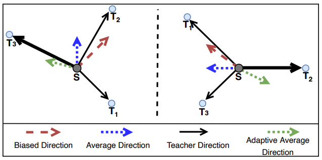
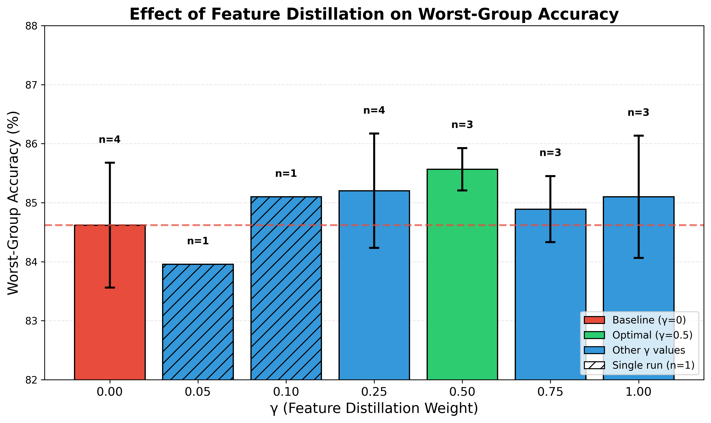
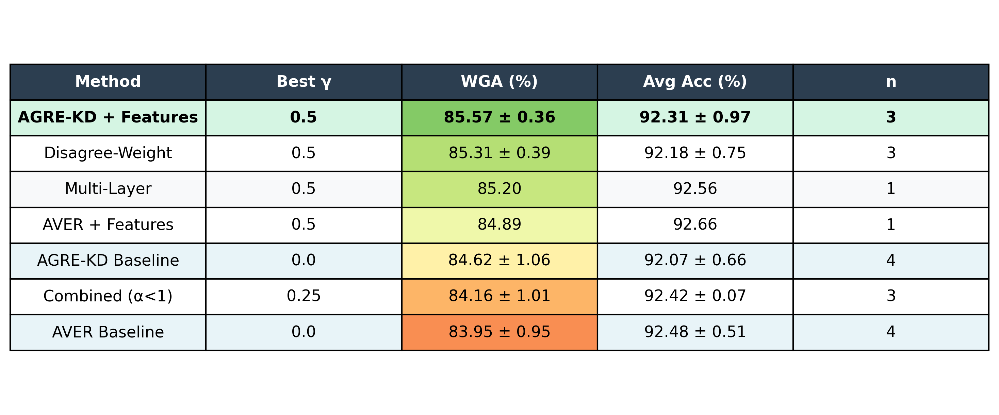
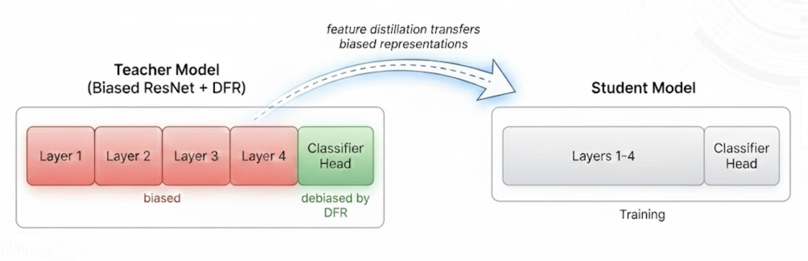

# Improving Group Robustness in Ensemble Knowledge Distillation: Beyond Logit Matching

**Dat Tran** · **Priscilla Leang**

---

## Introduction

Neural networks often learn spurious correlations, shortcuts that work on average but fail on minority subgroups. When models are compressed via knowledge distillation (KD), this problem gets worse: studies show the student model can become even more biased than its teacher (Lukasik et al., 2023; Lee & Lee, 2023). This bias amplification poses real problems for deployment scenarios where both efficiency and fairness matter.

Ensemble methods can improve worst-case group performance by combining diverse models, but deploying multiple networks is computationally expensive. **Ensemble knowledge distillation** addresses this by compressing multiple teachers into a single efficient student (Bucilă et al., 2006; Hinton et al., 2015). However, naive averaging of teacher predictions can amplify shared biases rather than cancel them.

**AGRE-KD** (Kenfack et al., 2025) addresses this through gradient-based teacher weighting: rather than equally averaging predictions, it downweights teachers whose gradients align with a biased reference model. This achieves state-of-the-art worst-group accuracy on benchmarks like Waterbirds. However, AGRE-KD distills only teacher logits. The authors explicitly note that feature distillation remains an open direction for future work.

We investigate this direction. We hypothesize that extending AGRE-KD with feature distillation, matching intermediate representations between teachers and the student, can transfer additional debiasing signal beyond logits alone and further improve worst-group accuracy.

Our experiments show that feature distillation provides modest but consistent improvement (+0.95% worst-group accuracy) with notably reduced variance across trials (±0.36% vs ±1.06%). We also find that these gains are constrained by how teachers are debiased. Specifically, Deep Feature Reweighting (DFR) affects only the classifier layer while leaving backbone features unchanged. Our analysis shows when feature distillation helps and suggests that stronger gains may require debiasing methods that operate on the full network, not just the classifier.

---

## Background & Related Work

### Spurious Correlations & Worst-Group Accuracy

Neural networks are effective at finding patterns, though sometimes the wrong ones. Given training data where waterbirds typically appear against water backgrounds and landbirds against land backgrounds, a model might learn "water background → waterbird" rather than actual bird features. This works on average but fails on **minority groups**: a waterbird photographed on land gets misclassified because the model relies on background rather than the bird itself (Sagawa et al., 2020).

**Worst-Group Accuracy (WGA)** measures robustness against such failures. It is the accuracy on the worst-performing subgroup (e.g., waterbirds on land backgrounds) rather than the overall average. Maximizing WGA ensures models work for all groups, not just the easy majority.

### Knowledge Distillation

Knowledge distillation (Hinton et al., 2015) trains a student network to match the soft probability outputs of a teacher, transferring "dark knowledge" encoded in the teacher's uncertainty. The KL divergence loss with temperature τ is:

$$
\mathcal{L}_{KD} = \text{KL}(\sigma(z_s/\tau) \| \sigma(z_t/\tau))
$$

Higher temperatures produce softer distributions, revealing more information about inter-class relationships.

### Ensemble Knowledge Distillation

Ensemble distillation extends KD by aggregating predictions from multiple teachers into a single student (You et al., 2017). Several methods address how to best combine teacher knowledge: Fukuda et al. (2017) randomly select teachers during mini-batch training to capture complementary knowledge, Du et al. (2020) use multi-objective optimization in gradient space to handle conflicting teacher gradients, and Zhang et al. (2022) weight teachers by prediction confidence. However, these approaches primarily target average accuracy improvements rather than group robustness.

Deep ensembles naturally improve worst-group accuracy through model diversity (Ko et al., 2023), but whether these benefits transfer through distillation remained unclear until recently. Studies on bias in single-teacher KD revealed that teacher errors can amplify during distillation. Students may become even more biased than their teachers due to reduced model capacity (Lukasik et al., 2023; Hooker et al., 2020). This effect is exacerbated in ensemble settings: when teachers share similar biases, simple averaging of their outputs reinforces rather than cancels these biases, causing the consensus gradient direction to minimize average error at the expense of minority groups. Addressing this bias amplification problem requires moving beyond simple averaging to adaptive teacher weighting.

### AGRE-KD: Gradient-Based Teacher Weighting

AGRE-KD addresses bias amplification through gradient-based teacher weighting. The key intuition is that if a teacher's gradient points in the same direction as a biased model's gradient, that teacher is likely giving biased advice for this sample, so we should trust it less.

For each sample $x_i$, AGRE-KD computes a per-teacher weight based on gradient alignment. Let $\ell_i^t(\theta)$ denote the KD loss between the student (with parameters $\theta$) and teacher $t$, and $\ell_i^b(\theta)$ the KD loss with respect to a biased reference model. The sample-wise teacher weight is:

$$
W_t(x_i) = 1 - \langle \nabla\ell_i^t(\theta), \nabla\ell_i^b(\theta) \rangle
$$

where $\langle \cdot, \cdot \rangle$ denotes the dot product of **normalized** gradient vectors (i.e., cosine similarity). This normalization is critical because gradient magnitudes can be noisy, so only the direction matters.

**Interpretation:** When the dot product approaches +1 (gradients aligned), the teacher behaves like the biased model, so its weight approaches 0. When the dot product approaches −1 (gradients opposed), the teacher provides maximally debiasing signal, so its weight approaches 2. Teachers are then aggregated using these weights:

$$
\mathcal{L}_{wKD} = \frac{\sum_t W_t(x_i) \cdot \mathcal{L}_{KD}^t}{\sum_t W_t}
$$

Figure 1 illustrates this: classic averaging yields a direction dominated by biased teachers, while adaptive weighting prioritizes the least biased models.

AGRE-KD uses teachers debiased via **Deep Feature Reweighting (DFR)** (Kirichenko et al., 2022). DFR makes a critical observation: even biased models learn useful core features alongside spurious ones. The problem is primarily in the final classifier layer, which over-weights spurious correlations. By freezing the backbone and retraining only the last layer on balanced data, DFR achieves strong WGA with minimal compute. This "last layer retraining is sufficient" insight has been influential in the robustness literature.

However, this means **the backbone features remain biased**. Only the classifier is debiased. The AGRE-KD authors note: *"We restrict ourselves to logit distillation and leave feature distillation for future exploration."*

---

## Method

### Problem Formulation

We extend AGRE-KD with a feature distillation term. Our full loss function combines three supervision signals:

$$
\mathcal{L}_{total} = (1-\alpha)\mathcal{L}_{cls} + \alpha\mathcal{L}_{wKD} + \gamma\mathcal{L}_{feat}
$$

The three terms are:

| Term                   | Formula                                                   | Role                                       |
| ---------------------- | --------------------------------------------------------- | ------------------------------------------ |
| $\mathcal{L}_{cls}$  | $\text{CE}(y, \hat{y}_s)$                               | Cross-entropy with ground-truth labels     |
| $\mathcal{L}_{wKD}$  | $\text{KL}(\sigma(z_s/\tau) \| \sigma(\bar{z}_T/\tau))$ | KL divergence with weighted teacher logits |
| $\mathcal{L}_{feat}$ | $\|f_s - \bar{f}_T\|_2^2$                               | MSE between student and teacher features   |

The hyperparameters control the balance:

- **α ∈ [0,1]**: Weight on KD vs class labels. α=1 means pure KD (no ground-truth labels)
- **γ ≥ 0**: Weight on feature distillation. γ=0 recovers standard AGRE-KD
- **τ = 4.0**: Temperature for softening logits

### Teacher Weighting and Feature Extraction

For the KD loss component, we use AGRE-KD's gradient-based weighting as described in Background. Teachers whose gradients align with the biased model are downweighted; those that diverge are upweighted.

For feature matching, we extract representations from the penultimate layer (after the final convolutional block, before the classifier). We compute a weighted average of teacher features using the same AGRE-KD weights:

$$
\bar{f}_T = \sum_{t=1}^{T} \frac{W_t(x)}{\sum_{t'} W_{t'}} \cdot f_t(x)
$$

**Dimension Adaptation:** Since teacher (ResNet-50) and student (ResNet-18) have different feature dimensions (2048 vs 512), we learn a linear projection layer (no bias term) that maps student features to the teacher dimension space:

$$
\mathcal{L}_{feat} = \|W_{proj} \cdot f_s - \bar{f}_T\|_2^2
$$

where $W_{proj} \in \mathbb{R}^{2048 \times 512}$ is a learned linear transformation applied to the student's global-average-pooled penultimate features $f_s \in \mathbb{R}^{512}$, and $\bar{f}_T \in \mathbb{R}^{2048}$ is the weighted average of teachers' pooled penultimate features. The projection is learned jointly with the student during training.

### Motivation for Feature Distillation

We investigate whether distilling features, not just logits, can transfer additional debiasing signal. Unlike logit distillation which only transfers output probabilities, feature distillation (Romero et al., 2015) allows the student to mimic the teacher's internal representations. Prior work shows that distilling from a single well-chosen layer often suffices, as additional layers can introduce noise or conflicting signals with diminishing returns (Heo et al., 2019).

Figure 2 illustrates our extended architecture. The student receives supervision from three sources: (1) weighted KL divergence loss from the teacher ensemble logits, (2) feature matching loss from the averaged teacher penultimate features via a learned projection layer, and (3) optionally, cross-entropy loss from ground-truth labels.

### Experimental Setup

**Dataset**: We evaluate on Waterbirds (Sagawa et al., 2020), a benchmark for spurious correlation robustness. The dataset contains 4,795 training images of birds with 4 groups defined by bird type (waterbird/landbird) and background (water/land). The spurious correlation arises because waterbirds predominantly appear on water backgrounds in training, causing models to rely on background rather than bird features.

**Teacher Preparation**: We train 5 teacher ensembles following the AGRE-KD pipeline:

1. **Base training**: Each ResNet-50 starts from ImageNet-pretrained weights and is fine-tuned on Waterbirds using standard ERM (Empirical Risk Minimization) for 30 epochs
2. **DFR debiasing**: We apply Deep Feature Reweighting (Kirichenko et al., 2022) to each teacher. DFR freezes the backbone and retrains only the final classifier layer on a balanced subset of the validation data. This corrects the classifier's reliance on spurious features while preserving the learned representations
3. **Ensemble diversity**: Each teacher is trained with a different random seed, producing slight variations in learned features despite sharing the same architecture

The resulting teachers achieve 91-94% WGA individually, compared to ~73.8% for undebiased ERM models.

**Biased Reference Model**: A single ResNet-50 trained with standard ERM (no debiasing) serves as the reference for computing AGRE-KD weights. Its gradient direction indicates the "biased" direction with spurious correlations that teachers should oppose.

**Student Training**:

- **Architecture**: ResNet-18 (ImageNet-pretrained)
- **Optimizer**: SGD with learning rate 0.001, momentum 0.9
- **Training**: 30 epochs, batch size 128
- **Seeds**: We run each configuration with seeds 42, 43, 44 to measure variance

**Evaluation**: We report Worst-Group Accuracy (WGA), the accuracy on the worst-performing of the 4 groups, as our primary metric. Each configuration is run 3 times (with seeds 42, 43, 44), and we report the mean WGA across these runs along with the standard deviation to quantify variance.

---

## Experiments & Analysis

### Baseline Validation: AGRE-KD vs Simple Averaging

**Motivation.** Before evaluating our feature distillation extension, we first verify that AGRE-KD's gradient-based teacher weighting provides benefit over simple averaging. This establishes our baseline and confirms the core mechanism works in our experimental setup.

**Setup.** We compare two teacher aggregation strategies, both without feature distillation (γ=0):

- **AGRE-KD**: Gradient-based per-sample teacher weighting
- **AVER**: Simple averaging of teacher predictions

**Results.**

| Method           | WGA              | n |
| ---------------- | ---------------- | - |
| AGRE-KD Baseline | 84.62 ± 1.06%   | 4 |
| AVER Baseline    | 83.95 ± 0.95%   | 4 |
| **Δ**     | **+0.67%** |   |

**Analysis.** AGRE-KD provides consistent improvement over simple averaging (+0.67%), validating the gradient-based weighting approach. This advantage persists across all γ values (~0.7% improvement), as we show in the Single-Layer Feature Distillation analysis below, confirming that gradient weighting is orthogonal to feature distillation.

### Single-Layer Feature Distillation

**Motivation.** As discussed in Method, we distill features from the penultimate layer (after global average pooling, before the classifier) as it contains the highest-level semantic representations. This layer is also where the feature dimension mismatch occurs (ResNet-50: 2048-dim → ResNet-18: 512-dim), requiring a learned projection.

**Setup.** We fix α=1.0 (pure KD, no ground-truth labels) and sweep γ ∈ {0, 0.05, 0.10, 0.25, 0.50, 0.75, 1.0} to find the optimal balance between logit and feature distillation signals. All experiments use penultimate layer (pooled) features only.

**Results.**

| γ              | WGA (%)                 | Variance      | Δ vs Baseline   | n |
| --------------- | ----------------------- | ------------- | ---------------- | - |
| 0.00 (baseline) | 84.62 ± 1.06           | High          | —               | 4 |
| 0.05            | 83.96                   | —            | -0.66%           | 1 |
| 0.10            | 85.10                   | —            | +0.48%           | 1 |
| 0.25            | 85.20 ± 0.97           | Medium        | +0.58%           | 4 |
| **0.50**  | **85.57 ± 0.36** | **Low** | **+0.95%** | 3 |
| 0.75            | 84.89 ± 0.56           | Low           | +0.27%           | 3 |
| 1.00            | 85.10 ± 1.03           | High          | +0.48%           | 3 |

**Analysis.** Feature distillation provides modest but consistent improvement, with γ=0.5 achieving the best WGA (+0.95% over baseline). Notably, γ=0.5 also exhibits the lowest variance across seeds (±0.36% vs ±1.06%), suggesting more stable training dynamics. Very low values (γ=0.05) can hurt performance, while very high values (γ=1.0) increase variance again. The optimal range appears to be γ ∈ [0.25, 0.75].

Importantly, this feature distillation benefit is orthogonal to the gradient-based teacher weighting. AGRE-KD maintains a consistent ~0.7% advantage over simple averaging (AVER) across all γ values tested:

| γ   | AGRE-KD | AVER   | Δ     |
| ---- | ------- | ------ | ------ |
| 0.00 | 84.62%  | 83.95% | +0.67% |
| 0.25 | 85.20%  | 84.42% | +0.78% |
| 0.50 | 85.57%  | 84.89% | +0.68% |
| 1.00 | 85.10%  | 84.27% | +0.83% |

This consistency confirms that the two mechanisms, gradient-based weighting and feature distillation, provide complementary benefits: AGRE-KD improves teacher selection per-sample, while feature distillation provides additional regularization that stabilizes training.

The improvement is limited. We analyze why in the Discussion section, attributing it to the DFR debiasing method which leaves backbone features unchanged.

### Three-Term Loss Analysis

**Motivation.** Our loss function combines three supervision signals: cross-entropy with ground-truth labels ($\mathcal{L}_{cls}$), weighted KD loss ($\mathcal{L}_{wKD}$), and feature matching ($\mathcal{L}_{feat}$). While the AGRE-KD authors show in their appendix that pure KD (α=1) outperforms mixed supervision, we test whether adding feature distillation changes this dynamic. Perhaps the combination of all three terms could be synergistic.

**Setup.** We test a matrix of (α, γ) combinations to understand how the three loss terms interact:

- α=1.0: Pure teacher supervision (KD only, no labels)
- α=0.9: 90% teacher, 10% label supervision
- α=0.7: 70% teacher, 30% label supervision

Each is tested with and without feature distillation (γ=0 or γ>0).

**Results.**

| α  | γ   | Loss Terms Used        | WGA (%)       |
| --- | ---- | ---------------------- | ------------- |
| 1.0 | 0.25 | KD + Features          | 85.20         |
| 1.0 | 0.00 | KD only (baseline)     | 84.62         |
| 0.9 | 0.25 | Labels + KD + Features | 84.16 ± 1.01 |
| 0.9 | 0.00 | Labels + KD            | 83.80         |
| 0.7 | 0.10 | Labels + KD + Features | 83.18         |
| 0.7 | 0.00 | Labels + KD            | 82.55         |

**Analysis.** Adding ground-truth labels consistently hurts performance, regardless of whether feature distillation is used. This confirms the AGRE-KD appendix finding in our extended setting. The best results come from α=1.0 (pure teacher supervision) combined with feature distillation.

The reason is that cross-entropy loss treats all samples equally, while AGRE-KD's gradient weighting specifically upweights minority group samples. Adding uniform label supervision dilutes this adaptive weighting, reducing emphasis on the hard minority samples that AGRE-KD is designed to handle. Feature distillation cannot compensate for this interference.

### Disagreement-Weighted Features

**Motivation.** Teacher disagreement has been used as a signal in ensemble distillation. UniKD (Du et al., 2022) weights the distillation loss by teacher disagreement, emphasizing samples where teachers disagree most. AE-KD (Du et al., 2020) handles conflicting teacher gradients through multi-objective optimization for both logit and feature distillation.

Inspired by these approaches, we test whether weighting feature dimensions by teacher agreement improves robustness. The intuition: feature dimensions where teachers agree (low variance) are more reliable signals; dimensions with high disagreement may contain noise or conflicting information.

**Setup.** We compute per-dimension variance across the 5 teachers' feature vectors. Features with low variance (high agreement) receive higher weight in the MSE loss; high-variance dimensions are downweighted:

$$
\mathcal{L}_{feat} = \sum_d w_d \cdot (f_s^{(d)} - \bar{f}_T^{(d)})^2, \quad w_d \propto \frac{1}{\text{Var}_t[f_t^{(d)}] + \epsilon}
$$

**Results.**

| Method                      | WGA (%)       |
| --------------------------- | ------------- |
| Standard AGRE-KD + Features | 85.57         |
| Disagree-Weight Features    | 85.31 ± 0.39 |

**Analysis.** Disagreement weighting provides no improvement. In fact, it slightly underperforms standard feature distillation. The reason lies in how teachers are constructed: all five teachers share the same ImageNet-pretrained ResNet-50 backbone. DFR only retrains the final classifier layer differently for each teacher, so their penultimate features are nearly identical. There is simply not enough feature disagreement across teachers to exploit.

This finding suggests that disagreement-based feature weighting would require teachers with genuinely diverse architectures or training procedures that produce different backbone representations.

### Multi-Layer Feature Distillation

**Motivation.** FitNets (Romero et al., 2015) proposed using intermediate "hints" from multiple layers to guide student training. The intuition is that earlier layers capture different levels of abstraction: low-level edges and textures in early layers, high-level semantic concepts in later layers. Multi-layer distillation could potentially transfer a richer hierarchy of representations.

**Setup.** Unlike our standard approach which uses pooled features (after global average pooling), multi-layer distillation extracts spatial feature maps directly from intermediate backbone stages. These spatial representations retain height and width dimensions, requiring 1×1 Conv2d adapters instead of linear projections to map student channels to teacher channels.

We test three configurations:

- **L4 only**: Penultimate layer (standard approach)
- **L3 + L4**: Add layer3 features
- **L2 + L3 + L4**: Add layer2 features

Layer weights are distributed to sum to γ=0.5 (the optimal single-layer value).

**Results.**

| Layers             | WGA (%) | Δ vs L4 only |
| ------------------ | ------- | ------------- |
| L4 only (standard) | 85.57   | —            |
| L3 + L4            | 85.20   | -0.37%        |
| L2 + L3 + L4       | 84.74   | -0.83%        |

**Analysis.** More layers leads to worse performance, the opposite of what multi-layer distillation typically achieves. The degradation increases with earlier layers: adding L3 costs 0.37%, adding L2 costs another 0.46%.

The reason is specific to our debiasing context: earlier layers in a CNN encode low-level features like textures, edges, and backgrounds. These are exactly the spurious correlations we want to avoid. Since teachers are trained with standard ERM before DFR, their early layers have learned to rely on background features. Distilling these layers transfers the spurious correlations to the student, counteracting the debiasing signal from the logits.

Interestingly, recent work on intermediate-layer matching suggests that layer-selection strategy has minimal impact on standard KD performance. Even unconventional matching strategies produce comparable results (arXiv:2502.04499). However, our results show this does not hold in the group-robustness setting, where layer choice critically affects whether spurious or semantic features are transferred.

This finding reinforces that for group-robust distillation, the penultimate layer is optimal; it contains the highest-level semantic features while avoiding the low-level spurious patterns encoded earlier in the network.

### Summary of Results

| Method                       | Best γ | WGA (%)                 | Avg Acc (%)   | n |
| ---------------------------- | ------- | ----------------------- | ------------- | - |
| **AGRE-KD + Features** | 0.50    | **85.57 ± 0.36** | 91.82 ± 0.47 | 3 |
| Disagree-Weight              | 0.50    | 85.31 ± 0.39           | 91.65 ± 0.52 | 3 |
| AGRE-KD Baseline             | 0.00    | 84.62 ± 1.06           | 91.42 ± 0.68 | 4 |
| AVER + Features              | 0.50    | 84.89 ± 0.56           | 92.15 ± 0.41 | 3 |
| AVER Baseline                | 0.00    | 83.95 ± 0.95           | 92.79 ± 0.53 | 4 |
| Combined (α<1)              | 0.25    | 84.16 ± 1.01           | 92.34 ± 0.62 | 3 |

---

## Discussion

### The DFR Limitation

The central finding across our experiments is that feature distillation provides only modest gains (+0.95%). This limitation stems directly from how Deep Feature Reweighting (DFR) works:

DFR retrains **only the final classifier layer** while keeping the backbone (layers 1–4) frozen from biased training, so distilling from layer4 still transfers biased representations and only the classifier is “debiasing.” This matches recent work showing that standard KD objectives can conflict with debiasing and that students may even become more biased than debiased teachers after distillation. These observations clarify why multi-layer distillation hurts (earlier layers encode stronger spurious cues like background), why disagreement weighting adds little (all teachers share nearly identical backbones), and why feature gains stay modest because most debiasing signal lives in the logits, not the features.

Recent extensions to DFR, such as all-layer deep feature reweighting (LaBonte et al., 2024), achieve better results by reweighting features from multiple layers rather than just the classifier. This suggests that combining AGRE-KD with backbone-level debiasing could unlock larger gains from feature distillation.

### Limitations

Our experimental setup differs from the original AGRE-KD paper in several ways that likely contribute to our lower baseline performance (84.62% vs. 87.9% WGA).

**Ensemble size.** We used 5 teachers rather than the paper's 10. The AGRE-KD appendix demonstrates that worst-group accuracy scales substantially with ensemble size, from approximately 82% with 5 teachers to 88% with 10 teachers, and up to 90% with 50 teachers. Our smaller ensemble likely explains a significant portion of the performance gap, as fewer teachers provide less diversity for the gradient-based weighting to exploit.

**Training duration.** Our students trained for 30 epochs compared to 100 epochs in the original work. This shorter training schedule, necessitated by our project timeline of approximately two weeks, may have resulted in students that had not fully converged. The feature distillation gains we observe might be larger with longer training that allows the projection layer to fully optimize.

**Dataset scope.** We evaluated exclusively on Waterbirds, a binary classification task with a single spurious correlation (bird type vs. background). The effectiveness of feature distillation may differ on datasets with more complex spurious structures, such as CelebA (multiple attributes) or MultiNLI (language-based shortcuts).

**Compute constraints.** This was a course project with limited computational resources. We prioritized experimental breadth, testing multiple hypotheses about feature distillation, over extensive hyperparameter tuning or larger-scale ablations.

**Batch-level gradient weighting.** Our AGRE-KD implementation computes teacher weights at the batch level rather than per-sample. While the original paper's notation $W_t(x_i)$ suggests per-sample weighting, computing individual gradients for each sample would require $O(\text{batch\_size} \times \text{num\_teachers})$ backward passes per training step. Our batch-level approach computes one weight per teacher per batch, reducing this to $O(\text{num\_teachers})$ backward passes while still capturing the gradient alignment signal. This is a common practical approximation in gradient-based methods.

---

## Conclusion

This work investigated whether feature distillation can improve group robustness in ensemble knowledge distillation, extending the AGRE-KD framework which the original authors explicitly left for future exploration. Our experiments on Waterbirds demonstrate that distilling penultimate-layer features provides modest but consistent improvement: a 0.95% gain in worst-group accuracy at the optimal weight (γ=0.5), while also notably reducing variance across training runs (±0.36% vs. ±1.06%). This suggests that feature matching regularizes training dynamics, even when the features themselves carry residual bias.

The central insight from our analysis is that the limited gains stem from a fundamental property of Deep Feature Reweighting (DFR): it debiases only the classifier layer, leaving backbone features unchanged from biased ERM training. When we distill these features, we transfer representations that still encode spurious correlations. The "debiasing" exists only in how the classifier combines them. This explains several of our findings: multi-layer distillation hurts performance because earlier layers are more biased, disagreement weighting provides no benefit because teachers share identical backbones, and adding ground-truth labels interferes with AGRE-KD's adaptive gradient weighting.

These findings clarify the conditions under which feature distillation would be more effective for group-robust knowledge distillation. Several directions warrant future exploration:

1. **Backbone-level debiasing**: Methods like all-layer DFR (LaBonte et al., 2024) that modify backbone features, not just classifiers, could provide genuinely debiased features to distill.
2. **Group-aware distillation losses**: Recent work on long-tailed KD suggests decomposing distillation by group and rebalancing explicitly (arXiv:2506.18496). This approach could complement AGRE-KD's sample-wise weighting with group-level balancing.
3. **Temperature tuning for fairness**: Research on distillation and fairness suggests that higher distillation temperatures can improve group fairness metrics. Students at T=5-10 can become fairer than their teachers (Lukasik et al., 2025). While we used τ=4.0 throughout, systematically exploring temperature's effect on worst-group accuracy presents another avenue for improving group-robust distillation.
4. **Architecturally diverse ensembles**: Teachers with genuinely different backbones would provide diverse feature representations that disagreement-based weighting could exploit.

With additional compute resources, extending this analysis to other spurious correlation benchmarks (CelebA, MultiNLI) and larger ensemble sizes would further validate these insights.

---

## References

### Foundational Knowledge Distillation

[1] Bucilă et al. "Model Compression." KDD, 2006.

[2] Hinton et al. "Distilling the Knowledge in a Neural Network." NIPS Workshop, 2015.

[3] Romero et al. "FitNets: Hints for Thin Deep Nets." ICLR, 2015.

[4] Heo et al. "A Comprehensive Overhaul of Feature Distillation." ICCV, 2019.

### Spurious Correlations & Group Robustness

[5] Sagawa et al. "Distributionally Robust Neural Networks for Group Shifts." ICLR, 2020.

[6] Kirichenko et al. "Last Layer Re-Training is Sufficient for Robustness to Spurious Correlations." ICLR, 2023.

[7] LaBonte et al. "Not Only the Last-Layer Features for Spurious Correlations: All Layer Deep Feature Reweighting." arXiv:2409.14637, 2024.

### Ensemble Knowledge Distillation

[8] Kenfack et al. "Adaptive Group Robust Ensemble Knowledge Distillation." NeurIPS, 2024.

[9] Du et al. "Agree to Disagree: Adaptive Ensemble Knowledge Distillation in Gradient Space." NeurIPS, 2020.

[10] Du et al. "Unified and Effective Ensemble Knowledge Distillation." arXiv:2204.00548, 2022.

[15] You et al. "Learning from Multiple Teacher Networks." KDD, 2017.

[16] Fukuda et al. "Efficient Knowledge Distillation from an Ensemble of Teachers." Interspeech, 2017.

[17] Zhang et al. "Confidence-Aware Multi-Teacher Knowledge Distillation." ICASSP, 2022.

[18] Ko et al. "Fair-Ensemble: When Fairness Naturally Emerges from Deep Ensembling." arXiv:2303.00586, 2023.

### Bias Transfer in Distillation

[11] Lukasik et al. "What's Left After Distillation? How Knowledge Transfer Impacts Fairness and Bias." TMLR, 2025.

[19] Hooker et al. "Characterising Bias in Compressed Models." arXiv:2010.03058, 2020.

[12] "Do Students Debias Like Teachers? On the Distillability of Bias Mitigation Methods." arXiv:2510.26038, 2025.

### Recent Advances

[13] "Revisiting Intermediate-Layer Matching in Knowledge Distillation." arXiv:2502.04499, 2025.

[14] "Biased Teacher, Balanced Student: Knowledge Distillation for Long-Tailed Recognition." arXiv:2506.18496, 2025.
